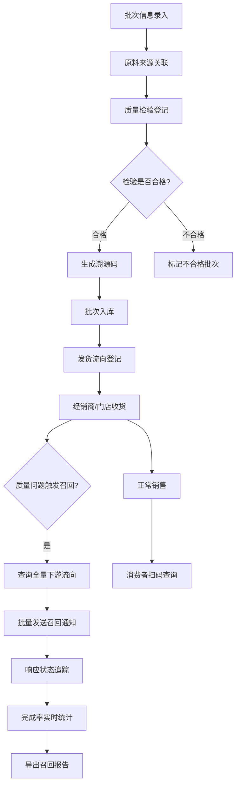

## 1. 产品概述
面向食品生产企业的批次级全链路溯源与召回管理平台，通过唯一溯源码实现从原料入库、生产检验、仓储发货、终端销售的全程追溯，在质量事故中快速定位下游流向并执行精准召回。
- 解决食品行业质量合规追溯难、召回响应慢、流向追踪不透明的核心痛点
- 目标用户：生产质量管理人员、仓储物流人员、售后召回专员、合规审计人员、终端消费者

## 2. 核心特性

### 2.1 用户角色
| 角色 | 注册方式 | 核心权限 |
|------|---------|---------|
| 生产管理员 | 企业内部账号 | 批次录入、检验结果管理、溯源码生成 |
| 仓储物流员 | 企业内部账号 | 入库确认、发货登记、流向管理 |
| 召回专员 | 企业内部账号 | 发起召回、通知下发、响应追踪、统计报告 |
| 合规审计员 | 企业内部账号 | 全流程查询、导出流转记录、召回报告 |
| 消费者 | 无需注册 | 扫码查询批次信息、检验结果 |

### 2.2 功能模块
1. **仪表盘首页**：数据总览、批次统计、召回概览、预警提醒
2. **批次管理**：批次录入、原料来源、检验结果、溯源码生成与打印
3. **发货流向**：出库登记、经销商/门店分配、运输记录
4. **召回管理**：发起召回、下游流向查询、通知群发、响应状态追踪
5. **消费者查询**：溯源码扫码查询页面
6. **数据导出**：流转记录导出、召回报告导出
7. **基础数据**：经销商管理、门店管理、原料供应商管理

### 2.3 页面详情
| 页面名称 | 模块名称 | 功能描述 |
|---------|---------|---------|
| 仪表盘 | 数据统计卡片 | 批次总数、在库量、已发货量、召回中批次、召回完成率 |
| 仪表盘 | 趋势图表 | 近30天批次入库趋势、召回事件时间线 |
| 仪表盘 | 预警列表 | 临期批次、检验不合格、召回未响应提醒 |
| 批次管理 | 批次列表 | 搜索、筛选、分页、状态标签 |
| 批次管理 | 批次录入表单 | 批次号、产品名称、生产日期、保质期、原料来源、检验项目、检验结果附件上传 |
| 批次管理 | 溯源码管理 | 批量生成溯源码、二维码预览、打印下载 |
| 批次管理 | 批次详情页 | 完整信息展示、流向链路图、时间轴记录 |
| 发货流向 | 发货登记 | 选择批次、选择经销商/门店、数量、发货日期、运输单号 |
| 发货流向 | 流向列表 | 按批次/经销商/时间筛选 |
| 召回管理 | 召回发起 | 选择批次、填写召回原因、召回等级、召回范围 |
| 召回管理 | 下游流向查询 | 一键展开该批次全部经销商/门店下游清单 |
| 召回管理 | 通知中心 | 批量发送召回通知、通知模板、发送记录 |
| 召回管理 | 响应追踪 | 已收到/已下架/已退回状态看板、实时完成率、自动催促标记 |
| 消费者查询 | 扫码结果页 | 产品信息、生产日期、检验结果、企业信息、投诉入口 |
| 数据导出 | 导出中心 | 流转记录筛选导出、召回报告一键生成PDF/Excel |
| 基础数据 | 经销商管理 | 增删改查、联系人、区域 |
| 基础数据 | 门店管理 | 所属经销商、地址、联系人 |
| 基础数据 | 原料供应商 | 供应商档案、资质有效期提醒 |

## 3. 核心流程

### 3.1 批次溯源入库流程
生产管理员录入批次信息 → 关联原料来源 → 录入检验结果（合格/不合格）→ 系统生成唯一溯源码 → 批次入库完成

### 3.2 发货流向登记流程
仓储员选择出库批次 → 指定经销商及下属门店 → 填写发货数量与运输信息 → 系统记录流转链路 → 更新批次库存

### 3.3 质量召回执行流程
召回专员发起召回 → 系统自动查询批次全量下游流向 → 一键群发召回通知 → 收货方反馈响应状态 → 系统实时统计完成率 → 超时未响应自动标记催促 → 召回完成生成报告

### 3.4 消费者溯源查询流程
消费者扫描产品溯源码 → 系统展示批次基础信息 → 展示检验结果与原料来源 → 显示产品当前状态（正常/召回中）

### 3.5 流程图

## 4. 用户界面设计

### 4.1 设计风格
- **主色调**：深绿色（#1B5E20）代表安全、合规、信任，搭配森林绿（#2E7D32）和薄荷绿（#A5D6A7）渐变层次
- **辅助色**：警示橙（#E65100）用于召回等级标识，危险红（#C62828）用于紧急召回和不合格标记，信息蓝（#1565C0）用于溯源码
- **按钮风格**：圆角 6px，2px 描边，主按钮深绿填充+白色文字，次要按钮白底+深绿描边
- **字体**：标题使用 "Noto Serif SC" 衬线体体现专业感，正文使用 "Noto Sans SC" 无衬线体保证可读性
- **布局风格**：顶部导航栏 + 左侧侧边栏 + 主内容区的经典企业后台布局，数据卡片采用微投影+圆角边框
- **图标风格**：线性图标，线宽 2px，与主色调一致

### 4.2 页面设计概览
| 页面名称 | 模块名称 | UI元素 |
|---------|---------|---------|
| 仪表盘 | 统计卡片 | 渐变背景图标、数据数字大字展示、同比变化小标签 |
| 批次管理 | 列表页 | 表格斑马纹、状态彩色标签、行内快捷操作按钮 |
| 批次管理 | 表单页 | 分区表单卡片、必填红星标记、上传拖拽区 |
| 批次详情 | 链路图 | 横向时间轴、节点连接线动画、悬浮显示详情 |
| 召回管理 | 状态看板 | 三列看板布局（已收到/已下架/已退回）、拖拽卡片 |
| 召回管理 | 完成率 | 环形进度条动画、渐变填充、中心数字 |
| 消费者页 | 查询结果 | 溯源码大图展示、绿色安全盾牌动画、信息分区卡片 |

### 4.3 响应式
- 桌面端优先设计，最小支持 1366px 宽度
- 平板端：侧边栏折叠为图标模式，统计卡片自适应换行
- 移动端：顶部导航压缩，表格转为卡片列表，召回看板改为垂直堆叠
- 所有表单支持触屏点击（按钮最小高度 44px）

### 4.4 动效设计
- 页面加载：主内容区从下往上淡入，卡片依次延迟 80ms 级联出现
- 批次详情时间轴：节点依次点亮动画，连接线从左到右绘制
- 召回完成率：环形进度条从 0 到目标值缓动增长，数字同步滚动
- 通知发送：发送按钮点击后涟漪扩散，成功状态对勾缩放动画
