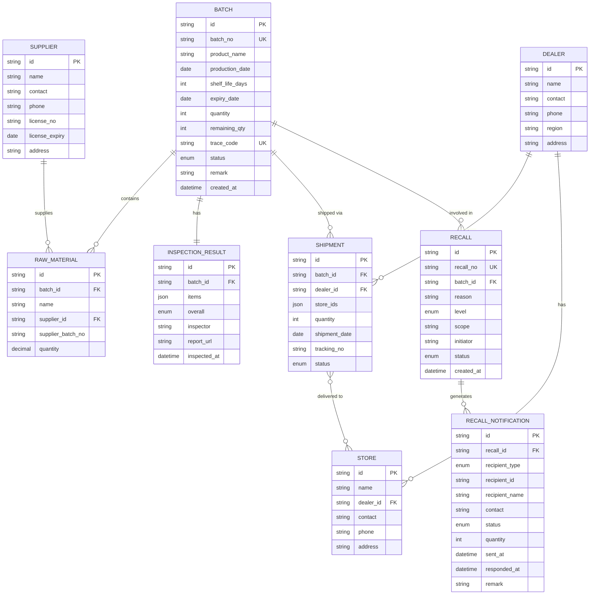

## 1. 架构设计

```mermaid
graph TB
    subgraph "前端层 (React + Vite)"
        A1["仪表盘 Dashboard"]
        A2["批次管理模块"]
        A3["发货流向模块"]
        A4["召回管理模块"]
        A5["消费者查询页"]
        A6["数据导出模块"]
        A7["基础数据模块"]
    end
    
    subgraph "数据层 (Mock Data + LocalStorage)"
        B1["批次数据 BatchStore"]
        B2["流向数据 ShipmentStore"]
        B3["召回数据 RecallStore"]
        B4["基础数据 BaseStore"]
        B5["状态管理 Zustand"]
    end
    
    subgraph "组件层"
        C1["Sidebar 侧边栏"]
        C2["Header 顶部栏"]
        C3["DataTable 数据表格"]
        C4["StatusTag 状态标签"]
        C5["QrCode 二维码组件"]
        C6["Timeline 时间轴"]
        C7["Kanban 看板"]
        C8["Modal 弹窗"]
        C9["Chart 图表"]
    end
    
    subgraph "工具服务层"
        D1["QRCode生成器"]
        D2["导出工具 (Excel/PDF)"]
        D3["日期格式化"]
        D4["ID生成器"]
        D5["通知模拟服务"]
    end
    
    A1 & A2 & A3 & A4 & A6 & A7 --> C1 & C2
    A2 --> C4 & C5 & C6 & C8
    A3 --> C3 & C4
    A4 --> C7 & C8 & C9
    A5 --> C5 & C6
    A1 --> C9 & C4
    A2 & A3 & A4 & A6 & A7 --> B5
    B5 --> B1 & B2 & B3 & B4
    A5 --> B1
    A2 --> D1 & D4
    A6 --> D2
    A3 & A4 --> D3
    A4 --> D5
```



## 2. 技术说明

- **前端框架**：React@18 + TypeScript
- **构建工具**：Vite@5
- **样式方案**：TailwindCSS@3 + CSS Variables 主题系统
- **状态管理**：Zustand@4（轻量级状态管理，支持持久化到 LocalStorage）
- **路由**：React Router DOM@6
- **图表库**：Recharts@2（轻量React图表库）
- **二维码生成**：qrcode.react@3
- **表格组件**：自定义 DataTable + TailwindCSS
- **日期处理**：dayjs@1
- **Excel导出**：xlsx@0.18
- **UI图标**：Lucide React（线性图标库）
- **动画库**：Framer Motion（页面过渡与微交互）
- **后端/数据库**：无后端，采用 Mock 数据 + Zustand + LocalStorage 持久化方案

## 3. 路由定义

| 路由 | 页面 | 用途 |
|-----|------|------|
| / | Dashboard 仪表盘 | 数据总览、统计图表、预警列表 |
| /batches | BatchList 批次列表 | 批次搜索筛选、分页列表 |
| /batches/new | BatchForm 新建批次 | 批次录入表单、检验结果、溯源码 |
| /batches/:id | BatchDetail 批次详情 | 完整信息、流向链路、时间轴 |
| /shipments | ShipmentList 发货列表 | 发货流向查询筛选 |
| /shipments/new | ShipmentForm 新建发货 | 出库登记、经销商分配 |
| /recalls | RecallList 召回列表 | 召回事件列表、状态概览 |
| /recalls/new | RecallInitiate 发起召回 | 选择批次、填写召回信息 |
| /recalls/:id | RecallDetail 召回详情 | 下游流向、通知追踪、状态看板 |
| /trace/:code | ConsumerTrace 消费者查询 | 扫码结果页、批次信息展示 |
| /export | ExportCenter 导出中心 | 流转记录、召回报告导出 |
| /dealers | DealerManagement 经销商管理 | 经销商CRUD |
| /stores | StoreManagement 门店管理 | 门店CRUD |
| /suppliers | SupplierManagement 供应商管理 | 原料供应商CRUD |

## 4. API 接口定义（Mock 层）

### 4.1 类型定义

```typescript
// 批次类型
interface Batch {
  id: string;
  batchNo: string;
  productName: string;
  productionDate: string;
  shelfLife: number;
  expiryDate: string;
  quantity: number;
  remainingQty: number;
  rawMaterials: RawMaterial[];
  inspection: InspectionResult;
  traceCode: string;
  status: 'pending' | 'qualified' | 'unqualified' | 'in_stock' | 'shipped' | 'recalling';
  createdAt: string;
  remark?: string;
}

interface RawMaterial {
  id: string;
  name: string;
  supplierId: string;
  supplierName: string;
  batchNo: string;
  quantity: number;
}

interface InspectionResult {
  items: InspectionItem[];
  overall: 'qualified' | 'unqualified';
  inspector: string;
  reportUrl?: string;
  inspectedAt: string;
}

interface InspectionItem {
  name: string;
  standard: string;
  result: string;
  status: 'pass' | 'fail';
}

// 发货类型
interface Shipment {
  id: string;
  batchId: string;
  batchNo: string;
  dealerId: string;
  dealerName: string;
  storeIds: string[];
  storeNames: string[];
  quantity: number;
  shipmentDate: string;
  trackingNo: string;
  status: 'transit' | 'delivered';
  remark?: string;
}

// 召回类型
interface Recall {
  id: string;
  recallNo: string;
  batchId: string;
  batchNo: string;
  productName: string;
  reason: string;
  level: 'level1' | 'level2' | 'level3';
  scope: string;
  createdAt: string;
  initiator: string;
  status: 'pending' | 'notifying' | 'in_progress' | 'completed';
  notifications: RecallNotification[];
}

interface RecallNotification {
  id: string;
  recallId: string;
  recipientType: 'dealer' | 'store';
  recipientId: string;
  recipientName: string;
  contact: string;
  status: 'pending' | 'sent' | 'received' | 'off_shelf' | 'returned' | 'urged';
  quantity: number;
  sentAt?: string;
  respondedAt?: string;
  remark?: string;
}

// 基础数据
interface Dealer {
  id: string;
  name: string;
  contact: string;
  phone: string;
  region: string;
  address: string;
  createdAt: string;
}

interface Store {
  id: string;
  name: string;
  dealerId: string;
  dealerName: string;
  contact: string;
  phone: string;
  address: string;
}

interface Supplier {
  id: string;
  name: string;
  contact: string;
  phone: string;
  licenseNo: string;
  licenseExpiry: string;
  address: string;
}
```

### 4.2 Store Actions

```typescript
// BatchStore
createBatch(data: Partial<Batch>): Batch;
getBatch(id: string): Batch | undefined;
getBatchByTraceCode(code: string): Batch | undefined;
listBatches(params?: FilterParams): Batch[];
updateBatchStatus(id: string, status: Batch['status']): void;
generateTraceCode(): string;

// ShipmentStore
createShipment(data: Partial<Shipment>): Shipment;
listShipments(params?: FilterParams): Shipment[];
getShipmentsByBatch(batchId: string): Shipment[];

// RecallStore
createRecall(data: Partial<Recall>): Recall;
listRecalls(params?: FilterParams): Recall[];
getRecall(id: string): Recall | undefined;
queryDownstream(batchId: string): RecallNotification[];
sendNotifications(recallId: string): void;
updateNotificationStatus(notificationId: string, status: RecallNotification['status']): void;
urgeRecipients(recallId: string): string[];
getRecallStats(recallId: string): RecallStats;

// Export Service
exportBatchRecords(params?: FilterParams): Blob;
exportRecallReport(recallId: string): Blob;
```

## 5. 数据模型（ER图）



## 6. 前端目录结构

```
src/
├── assets/              # 静态资源
│   └── images/
├── components/          # 通用组件
│   ├── layout/         # Header, Sidebar, Layout
│   ├── ui/             # Button, Input, Modal, Tag, Card
│   ├── DataTable.tsx
│   ├── QrCode.tsx
│   ├── Timeline.tsx
│   ├── Kanban.tsx
│   └── Chart.tsx
├── pages/              # 页面组件
│   ├── Dashboard.tsx
│   ├── batches/
│   │   ├── BatchList.tsx
│   │   ├── BatchForm.tsx
│   │   └── BatchDetail.tsx
│   ├── shipments/
│   │   ├── ShipmentList.tsx
│   │   └── ShipmentForm.tsx
│   ├── recalls/
│   │   ├── RecallList.tsx
│   │   ├── RecallInitiate.tsx
│   │   └── RecallDetail.tsx
│   ├── ConsumerTrace.tsx
│   ├── ExportCenter.tsx
│   └── master/          # 基础数据管理
│       ├── DealerManagement.tsx
│       ├── StoreManagement.tsx
│       └── SupplierManagement.tsx
├── store/              # Zustand stores
│   ├── batchStore.ts
│   ├── shipmentStore.ts
│   ├── recallStore.ts
│   └── baseStore.ts
├── types/              # TypeScript 类型定义
│   ├── batch.ts
│   ├── shipment.ts
│   ├── recall.ts
│   └── master.ts
├── utils/              # 工具函数
│   ├── qrcode.ts
│   ├── export.ts
│   ├── date.ts
│   ├── idGenerator.ts
│   └── notification.ts
├── mock/               # Mock 数据种子
│   ├── seedBatches.ts
│   ├── seedShipments.ts
│   ├── seedRecalls.ts
│   └── seedMaster.ts
├── App.tsx
├── main.tsx
└── index.css
```
